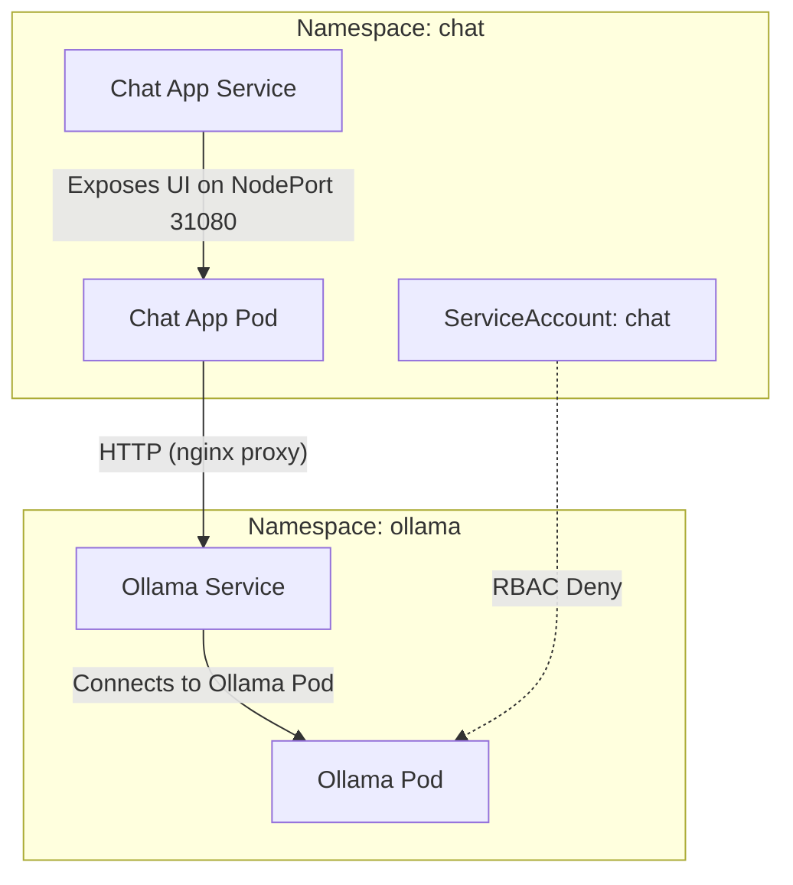

# Session 1: Namespace of Mind

Welcome! In this session, we'll discover how Kubernetes namespaces help us organize, isolate, and secure our workloads—just like rooms in a house keep activities and people separated, but still under one roof.

## Why Namespaces?

Imagine a busy office: each team has its own room, with its own resources and permissions. Kubernetes namespaces work the same way, letting us:

- **Isolate environments** (dev, test, prod)
- **Delegate ownership** (team or feature sandboxes)
- **Control access** (RBAC per namespace)

This session uses a local [kind](https://kind.sigs.k8s.io/) cluster, so we can experiment freely. Everything is ephemeral—restart or delete the cluster to start fresh.

---

## When and Why to Create a Namespace

Namespaces are our tool for grouping resources that share a lifecycle, owner, or purpose. We should ask ourselves:

- Will these resources be upgraded or deleted together?
- Should only a specific team have access?
- Would it be useful to clean them up as a group?

---

## Goals

- Understand what namespaces are and why they matter
- Create and explore namespaces using `kubectl`
- Deploy applications into multiple namespaces and observe isolation
- Experiment with RBAC basics

---

## 🗂️ Visualizing Namespaces

A picture is worth a thousand words. Here's how our demo cluster is organized:



---

## 🧑‍💻 Guided Hands-On: Exploring Namespaces

Let's walk through some practical exercises to see namespaces in action.

### 1. List and Explore Namespaces

```bash
kubectl get namespaces
kubectl get all -n ollama
kubectl get all -n chat
```

Notice how resources are grouped and isolated by namespace.

### 2. See Isolation in Action

Try creating a ConfigMap with the same name in both namespaces:

```bash
kubectl create configmap demo-cm --from-literal=foo=bar -n ollama
kubectl create configmap demo-cm --from-literal=foo=baz -n chat
kubectl get configmap demo-cm -n ollama -o yaml
kubectl get configmap demo-cm -n chat -o yaml
```

No conflicts! Namespaces keep resources separate.

### 3. Service Discovery Across Namespaces

The chat app in `chat` can reach Ollama in `ollama` via Kubernetes DNS:

```
http://ollama.ollama.svc.cluster.local:11434
```

Try it from a debug pod:

```bash
kubectl run -n chat -it --rm debug --image=alpine -- sh
# Inside the pod:
wget -qO- http://ollama.ollama.svc.cluster.local:11434
```

---

## 🔐 RBAC: Restricting Access Across Namespaces

Namespaces are also a boundary for permissions. Let's see how RBAC can enforce this.

### 4. Apply RBAC Policy

```bash
kubectl apply -f rbac.yaml
```

### 5. Test RBAC Denial

Try to list pods in the `ollama` namespace as the `chat` service account:

```bash
kubectl auth can-i list pods -n ollama --as=system:serviceaccount:chat:chat
# Should return "no"
```

Try to access the Ollama API from the chat app and observe the error (if you have logging).

---

## 🧹 Cleanup and Group Operations

Namespaces make cleanup easy. Delete a namespace and all its resources are gone:

```bash
kubectl delete namespace chat
kubectl get all -n chat  # Should show nothing
```

---

## 📝 Namespace Design Decisions: What to Consider

When designing our namespaces, we should think about:

- **Lifecycle:** Should these resources be upgraded/removed together?
- **Access:** Should a team or app have exclusive access?
- **Resource Quotas:** Do we want to limit CPU/memory per group?
- **Network Policies:** Should traffic be restricted between namespaces?
- **RBAC:** Should only certain service accounts access certain namespaces?

---

## 🚀 Try These Exercises

1. **Create a new namespace and deploy a pod:**
   ```bash
   kubectl create namespace playground
   kubectl run -n playground testpod --image=nginx
   kubectl get pods -n playground
   ```

2. **Try to access Ollama from the new namespace (should work if no RBAC/network policy blocks it).**

3. **Apply a resource quota to a namespace and try to exceed it.**

---

## Reflection: Our Namespace Story

Let's think about how namespaces help us organize, secure, and simplify our Kubernetes workloads? What boundaries make sense for our teams and applications?

Namespaces are more than a technical feature—they're a way to bring order and clarity to our cluster. Happy experimenting!
